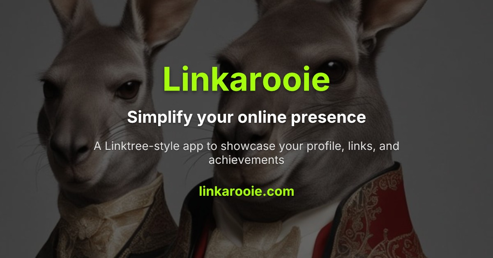

# 🔗 Linkarooie

G'day! Welcome to **Linkarooie** - my Linktree alternative built with Astro and Tailwind CSS. It's a blazingly fast, fully customisable way to showcase your online presence with your own links and achievements.



## 🚀 Features

- **Profile Showcase**: Display your name, bio, avatar, and social media links
- **Custom Links**: Add your important websites, projects, and resources
- **Achievements**: Show off certifications, milestones, and accomplishments
- **Dark/Light Mode**: Toggle between themes with persistent preferences
- **Mobile-Friendly**: Fully responsive design for all devices
- **SEO Optimised**: Custom metadata and OG images for better sharing
- **Hidden Treasures**: Secret cheat code Easter eggs for the true diggers (hint: try typing "iddqd" on my profile)

## 🔧 Getting Started

### 1. Create Your Own Copy (Fork)

To get your own copy of Linkarooie that you can customize:

1. Make sure you're logged into your GitHub account
2. Visit the Linkarooie repository at https://github.com/loftwah/linkarooie-3
3. Click the "Fork" button in the top-right corner
4. GitHub will create a copy of the repository under your account

Now you have your own version of Linkarooie that you can modify!

### 2. Download Your Copy to Your Computer (Clone)

Open your terminal or command prompt and run these commands:

```bash
# Replace YOUR-USERNAME with your actual GitHub username
git clone https://github.com/YOUR-USERNAME/linkarooie-3.git

# Move into the project folder
cd linkarooie-3
```

### 3. Install Dependencies

Using npm:

```bash
npm install
```

Or using Bun (recommended):

```bash
bun install
```

### 4. Customise Your Profile

1. **Create your profile file**:

   - Duplicate `src/data/profiles/loftwah.ts` and rename it to `yourusername.ts`
   - Edit the file with your own information, links and achievements

2. **Add your images**:

   - Place your avatar, banner and OG images in `src/assets/images/`
   - Update the import paths in your profile file

3. **Update the index**:
   - Edit `src/data/index.ts` to import and export your profile

### 5. Generate Social Media Preview Images

Linkarooie includes scripts to generate custom Open Graph (OG) images for social media sharing:

1. **Generate main site preview image**:

```bash
# Default dark theme
bun run scripts/generate-main-og-image.ts

# Light theme
bun run scripts/generate-main-og-image.ts --theme=light
```

2. **Generate profile preview image**:

```bash
# Default dark theme
bun run scripts/generate-og-image.ts

# Light theme
bun run scripts/generate-og-image.ts --theme=light
```

These scripts create professional social sharing images with your profile details and the Linkarooie branding.

### 6. Local Development

Start the development server to see your changes in real-time:

```bash
npm run dev
# or
bun dev
```

Visit `http://localhost:4321` in your browser to see your site.

### 7. Deploy to GitHub Pages

#### Set Up GitHub Pages

1. Go to your forked repository on GitHub
2. Navigate to "Settings" > "Pages"
3. Under "Build and deployment" > "Source", select "GitHub Actions"

#### Configure BASE_URL Secret (Important!)

This setting ensures all links on your site work correctly:

1. Go to "Settings" > "Secrets and variables" > "Actions"
2. Click "New repository secret"
3. Add the `BASE_URL` secret:
   - For GitHub Pages: `https://YOUR-USERNAME.github.io/linkarooie-3`
   - For custom domain: `https://yourdomain.com`

**Note:** Replace `YOUR-USERNAME` with your actual GitHub username.

#### Deploy Your Site

1. Push your changes to the main branch:
```bash
git add .
git commit -m "Customized my Linkarooie"
git push
```

2. GitHub Actions will automatically build and deploy your site
3. You can also manually trigger a deployment from the "Actions" tab using "workflow_dispatch"

#### Check Your Deployment

After the GitHub Action completes, your site will be live at:
`https://YOUR-USERNAME.github.io/linkarooie-3`

### Using a Custom Domain

Want to use your own domain like I did with `linkarooie.com`? Here's how:

1. **Buy a domain** from a registrar like Namecheap

2. **Set up Cloudflare for DNS**:

   - Create a free Cloudflare account
   - Add your domain to Cloudflare
   - Update your domain registrar to use Cloudflare nameservers
   - In Cloudflare, add a `CNAME` record pointing to `YOUR-USERNAME.github.io`
   - Set the proxy status to "Proxied" for free SSL and performance benefits

3. **Set up in GitHub repo**:

   - Go to your repo's "Settings" > "Pages"
   - Under "Custom domain", enter your domain name and click "Save"
   - Make sure "Enforce HTTPS" is ticked for secure connections

4. **Update the CNAME file**:

   - The repo already includes a `CNAME` file
   - Edit it to replace `linkarooie.com` with your own domain name

5. **Update BASE_URL secret**:
   - Go to "Settings" > "Secrets and variables" > "Actions"
   - Update the `BASE_URL` to your custom domain (e.g., `https://yourdomain.com`)

## 🛠️ Customisation

### Changing Colors

Edit `tailwind.config.js` to change the primary and accent colors.

### Customizing OG Images

Both OG image generation scripts support dark and light themes:

- Dark theme uses a green accent (#a5fd0e)
- Light theme uses a purple accent (#9233ea)

You can modify these colors in the respective scripts.

### Adding New Features

The codebase is pretty straightforward. Have a geez at:

- `src/components/` for UI components
- `src/layouts/` for page layouts
- `src/pages/` for the main routes
- `src/types/` for TypeScript interfaces
- `scripts/` for utility scripts including OG image generation

## 🤝 Contributing

Feel free to submit pull requests with improvements or new features! I'm always keen to make Linkarooie better.

## 📝 License

MIT License - feel free to use, modify and share as you please. Attribution is appreciated but not required.

## 👋 Connect with Me

If you've got questions or want to show me what you've built with Linkarooie, give us a shout:

- GitHub: [@loftwah](https://github.com/loftwah)
- Twitter: [@loftwah](https://twitter.com/loftwah)
- LinkedIn: [deanlofts](https://linkedin.com/in/deanlofts)

---

Built with 💚 by [Loftwah](https://github.com/loftwah) - Only the vibe coder remains.
